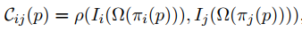
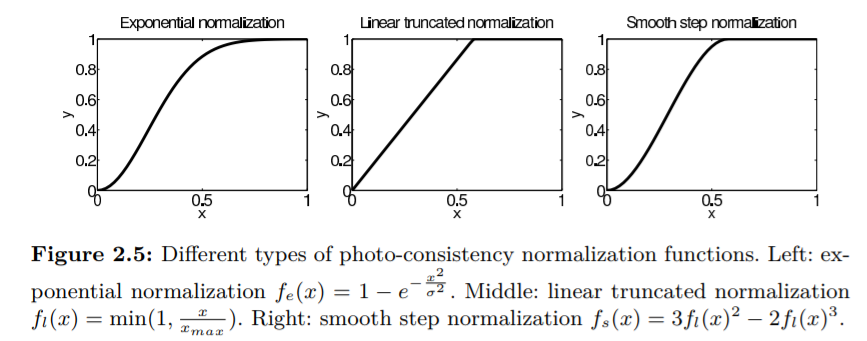

摘要:
该教程是MVS领域专注于实用算法的实践手册,MVS算法是只依赖于图像,基于一些合理的假设(比如?)重建出真实精确的3d模型. 最重要的是场景固定.该教程将mvs问题转化成图像/几何约束优化问题.详细来说主要在两方面: 1.鲁棒实现图像一致性检测;2.有效的优化算法.
主要讲了这两因素在应用程序和工业中如何应用.本教程还描述了高级方法涉及到领域专业知识如:结构优化,以及接下来的挑战和未来的研究方向.

1简介

1.1 图像获取
  有序无序

1.2 相机投影模型
MVS算法需要知道每个图片对应的相机模型--描述如何将3D点投影到对应的2D空间,采用针孔相机模型.
任何一个3X3矩阵都可以分解成3x3的上三角矩阵K和3X4矩阵的乘积[R|T].

K --- 内参矩阵
(fx, fy): 垂直/水平焦距
(cx, cy): 主点
s       : 扭曲

[R|T] --- 外参矩阵
R : 旋转参数
T : 平移参数

一般假设 s = 0, fx = fy  图像没裁剪时主点在相机中心,因此相机参数由 焦距,旋转矩阵和平移矩阵7个参数;
对于附加镜头或者广角相机,通常要加上一个镜像畸变.尤其是对高分辨率图像.微小的偏离涉及到边界的多个像素值.

镜像畸变通过重采样消除, 好处,简化算法,加速计算.手机或者专用硬件在图像获取之后,处理之前进行去畸变处理.修正的广角图像需要,需要mvs算法支持更多处理.

1.3 SFM算法
输入:一系列图像. 输出:每张图像的相机参数和图像中3D点坐标, 编码成图像的tracks.
算法流程:
1. 计算每张 图像的2D特征点
2. 2D点匹配
3. 从匹配关系构建2D tracks
4. 从 2D tracks 解sfm 模型
5.  bundle adjustment优化sfm模型

算法: RANSAC 从有噪声的匹配中计算极线几何
1> 多相机的欧几里得重建---估算相机参数和tracks 3D点
2> 构建longer tracks

1.4 Bundle Adjustment算法
 
1.5 Multi-View Stereo

## chapter 2
N张输入图像和一个所有图像都可以看到的3D点p,任意一对图像Ii和Ij关于点p的图像一致性 表示如下:

式中:
p: 3D点;
 πi(p): 点p在图像i中的投影;
Ω(x):点x附近的邻域;
Ii(x): 在区域Ω内的图像强度 
ρ(f, g):两个vector之间的相似性测量;

图像一致性可以通过ρ和Ω的选择来确定.

一些图像一致性不需要邻域Ω一些需要, 邻域的主要作用是确定一块场景的区域是唯一的与场景和视角无关.唯一性和不相关性在图像一致性中经常互斥,邻域越大,图像唯一性的可能就越大,与其它图像的越容易匹配,同时邻域越大,由于变形,深度限制和平滑吉和假设(例如:平面假设)越难维持照明和视口不相关.

MVS算法中, 定义邻域的简单方法是:用一个固定大小的正方形像素网格，当输入图像与正在重建的表面共享大致相同的像素分辨率时这种方法很有效, eg,使用 3x3或者5x5的像素大小, 在更复杂的场景,图像的分辨率不一致,场景位置不是均匀分布的, 调整邻域的大小非常困难, 尺寸需要成比例
相反，图像分辨率和视点分离与场景的距离成正比。 有些方法甚至会改变邻域的形状，其中一个特别成功的实例
视图相关域是通过将域Ω计算为投影以3D点p为中心的3D局部区块 [210, 74],其他方法显着增加图像的密度，
这可以实现更小的域大小，极端情况是使用视频[145]或光场[195,117]

该领域相关的 概念非常相近的是概念是图像一致性聚合[162]，其中包括
在空间上聚合照片一致性测量以增加其鲁棒性。当在没有域的情况下计算的度量一起使用时它是最有效的, 例如 差分平方和Sum of Square Differences (SSD)和 差分绝对值和 Sum of Absolute Differences (SAD)由于先进的聚合技术能在不需要平滑的情况下使用(详见2.1.8).

图像一致性的定义见式2.1, 点的图像一致性可以定义如下,通过对单个图像相关的所有图像对的图像一致性求平均

及对所有图相对的图像一致性求平均.

如上所述:图像一致性的定义要求所有图像包含给定点,就是说必须已知图像包含给定点.接下来描述一些常用的图像一致性测量方法,详细信息见[99], 通过比较f和g两个vector计算 图像一致性, f,g可以通过采样灰度图的矩形区域来获取如图2-1所示;

对于彩色图像,操作如下:
1.计算图像一致性之前将彩色图转为灰度图
2.对rgb通道,每个通道单独计算图像一致性,求平均
3.将,每个通道的vector合并成大的vector

简要说明下对于有无纹理的表面不同的测量方式如图2-2, 图2-3表示随着点沿着对极线移动时的图像一致性曲线,

#### 2.1.1 Normalized Cross Correlation(归一化交叉相关性)
zero-mean NCC 是多视觉立体几何中最常用的一致性测量算法之一, 算法图像增益与偏差无关,并且与材质和光照无关条件下使用例如计算
收集的图像光照和材质相差很多的情况下使用,NCC算法的缺点是缺少表面纹理和重复纹理,计算精度高.计算公式如下

f 均值 σ标准差 f

对于彩色图像,将所有颜色简单的集中到一个vector应用上述公式中的效果不佳,在复杂情况下例如均匀纹理表面,主要视觉线索通常是其表面的细微阴影和阴影效果我们想要
NCC捕捉每个颜色通道中细微的空间强度变化，比颜色的强度变化小得多渠道。通过简单的连接，NCC只需要捕获不同颜色通道的强度变化。更好的解决方案
是独立计算每个颜色通道的NCC并返回NCC平均得分。更复杂的方法是计算和单独减去每个颜色通道的平均强度（’f和G’），但将所有颜色通道作为单个向量连接在一起计算其方差时（σf和σg）。这允许NCC捕获
每个颜色通道中的空间强度变化，同时降低权重具有较小强度变化的颜色通道。

#### 2.1.2  Sum of Squared Differences(平方差求和) SSD

#### 2.1.3 Sum of Absolute Differences(差分绝对值)

#### 2.1.4 Census 统计方法

#### 2.1.5 Rank 

#### 2.1.6 Mutual information 互信息

#### 2.1.7 interval comparison间隔对比

*** Photo-consistency normalization ***

以上方法中的图像一致性测量方法很少作为MVS方法的最后阶段应用；相反，经常通过非线性操作转化用于以下目的：i>不同的图像一致性值归一化到同样的范围区间；II>将原始的图像一致性转化到“几何似然”，归一化对参数优化同结合图像一致性计算一样重要，或者其他因素。典型的转换包括：指数函数、线性截断函数、平滑函数，如图2.5；归一化函数就像一个黑箱，将图像一致性值转化成几何似然测量值，i.e.描述了它可能是3D几何的概率范围。

上图中三个对应的函数分别为：
1>.
2>.
3>.

以上三个归一化函数中，指数函数理论上来讲是最合理的，也是最常用的。如果是高斯噪声函数并且没有外点，对SSD来说是最佳的函数。然而纯高斯噪声是不现实的，这就是为什么通常会优先选用SAD而不是SSD方法。
当考虑到图形一致性的内外点噪声模型时，归一化函数的形状期望是sigmoid形状的，有两个平缓的变化，中间是相对倾斜的变化量。如图2.5所示。其中的原理是：陡坡被认为是区分内外点的阈值。例如SAD方法中，典型的内点误差小于5级（共255级），典型的外点值高于10级，一旦SAD值高于10级，无论是20还是30，都会对应一个很低的几何似然值，相同的NCC值低于1/1.414的都会被认为不够精确会被丢弃。

#### 2.1.8 Photo-consistency aggregation(集合/聚集)***
图像一致性是一种带噪声的测量方式，并且再用来计算3D几何之前需要滤波操作。滤波操作的独立于计算一致性时候的作用域，作用域可以看成是一个集合，滤波操作通常不需要作用域例如SAD,有时间限制的算法，以及局部优化方法代替全局优化方法例如图割算法。

#### 2.1.9 Photo-consistency representation()***
最基础的滤波操作就是在局部域求平均值，例如一个固定大小的方块。 SAD方法中
#### 2.1.10 Popular choice

## **chapter 3 基于图像一致性的三维重建**

基于第二章的图像一致性算法，本章将会详细介绍最近几年流行的多视角立体几何算法。区分MVS算法有许多因素，例如图像一致性函数，场景表达，可视化计算和初始化条件。因此提出一个单独的分类并不容易。本文将会依据输出的场景表示方法作为主要分类方式。因为它决定了应用的场景，有兴趣的读者可以参考[165]查看mvs算法的分类方法。
Fig3.1 表示4种常用的表示方法：深度图、点云、体素场、mesh面片，每个重建算法的state-of-the-art 方法介绍。点云重建方法的渲染方式是采用基于点的渲染技术[160,83],展示了一个完整的纹理渲染模型，但是点云模型仅仅是独立的带颜色的3D点；体素场常用于计算机视觉和计算机图形学表示3D平面，常将体素场当成距离一个平面的带符号的距离函数，该平面是函数场的零势面。
Fig3.2表示MVS算法的重建步骤和中间或者最终几何形态类型，许多MVS算法集中于单个重建步骤，然而有些将多个步骤组合成操作管线，本表表达了大多数MVS算法/系统，除了一种算法-直接通过图像一致性体素构建mesh，通过体素融合方法[190，102]，再这个方法中，图像一致性体素替换了点云图或者深度图。
当然有许多过去开发的算法再这里没有列举出来，例如level-set方法，level-set曾经在MVS算法中非常流行，因为它能处理拓扑结构的变化[58]，典型的重建步骤是初始化模型然后进行优化，拓扑结构的初始化可能是不正确的，然而level-set不再被使用因为更好的初始化或者重建算法（见本章）已经被开发出来。高质量的模型和正确的拓扑结构能够直接通过图像一致性获取，因此就不需要优化过程。同样的早些时候许多算法基于visual hull初始化mesh形态，然而最新也不再使用，因为形状的提取过程通常需要人工手动提取，visual hull 不再是有效的近似或者对于有许多凹面的结构情况不再有效，更好的初始化重建技术发展也加速就有方法的淘汰。[注全自动的形态提取方法见47，49，50]。

*** 3D表达和应用 ***
表3.1 总结了四种场景表示方法在三种流行应用中的可行性分析，3D重建的主要应用是在图形学中(可视化)，同时表格列出了两种不同的可视化应用。
基于视图的纹理映射技术依赖于渲染相机视角改变图像的渲染，该技术产生沉浸式的可视化体验，由于渲染主要基于实时图像，并且能传递复杂的广度效果例如镜面高光或者透明半透明，这些都是很难去模拟的[54，68，170]，谷歌街景[81]是一个很好的基于视图纹理映射技术的例子，但是，为了避免渲染伪影，渲染摄影机必须靠近输入图像。渲染摄影机的运动范围严重受限于输入照片的覆盖范围。深度图表达方式对视图的纹理映射技术及其有效，因为它的几何形状可以优化渲染每一个透视图[127].天空的建模对于室外场景的可视化很有挑战，因为几何形状难以描述不容易重建，深度图为了达到更好的渲染效果可以为每个透视图生成几何代理，对Mesh、点云，体素来说并不容易，因为他们是独立于视图的。
另一方面，自由视点渲染运行在空间自由移动，对于导航和浏览目的的应用更友好，google地图就是很好的例子，然而渲染通常独立于视图并且缺少真实感。对于自由点渲染方法，mesh或者点云更合适，纹理映射的MVS mesh方法已经成功应用在城市户外可视化产品中[30，108，144]。基于点的渲染技术已经应用于计算机图形学中[83]，高质量的可视化点云或者深度图(也可以做点云处理[69,117,104])产生高质量的可视化结果。然而对于MVS生成的点云有很少的工作集中在基于点云的渲染方法，MVS点云常有噪点和重建出来的孔洞，渲染质量会严重降低。
最后的应用是几何操作。随着MVS技术的发展和重建的场景越来大，越来越复杂，几何操作功能越来越重要。为了完成一个场景的模型，处理多个MVS重建结果是必须的。对于这项任务mesh表示方式存在很大的挑战，因为通过合并和拆分来控制网格的拓扑结构很困难，所以会有几何操作方式。
在图3.2中，抛光体素（体积标量场）和mesh网格在图的底部。但是这可能不是每个MVS系统目标。 例如，如果依赖于视图的纹理映射
应用程序，应该简单地选择深度图重建算法。如果是自由视点渲染应用程序，则可以从图像进行点云重建，然后可以对应用程序使用基于点的渲染技术，而无需运行图中的任何其他步骤。 当然，高质量的多边形mesh网格模型通常是首选的场景表示，并且所有处理都归于图中的网格重建。

*** Evaluations ***

MVS研究人员进行了定量评估以验证MVS算法的准确性[165,176]。 Seitz, Curless, Diebel,
Scharstein和Szeliski在2006年为MVS定量评估奠定了基础[165]，该评估在具有低分辨率（640×480）图像的两个物体数据集上评估MVS算法，这些数据集是在具有一定照明的实验室环境中仔细获得的。此评估称为Middlebury MVS评估。虽然低分辨率图像的使用可能无法反映现代消费市场中高分辨率数码相机的存在，但它具有最小化校准误差影响的优点：更高的图像分辨率需要更精确和可重复的机械装置（例如机器人手臂）。几年后，Strecha，Hansen，Van Gool，Fua和Thoennessen发布了互补的MVS基准数据集和评估系统，重点关注室外场景和高分辨率输入图像，这反映了MVS研究的趋势和需求[176]。许多算法在重建精度方面令人印象深刻（例如，在640×480图像的20cm体积内0.5mm精度），并且还产生了引人注目的3D模型，包括本章中介绍的所有最优的算法。
一个缺失的评估是重建模型的视觉质量。Middlebury MVS 评估揭示了这样一个事实， 即纯几何量化指标并不总能反映模型的视觉质量。 换句话说，具有清晰视觉伪影的模型有时会获得更好的几何精度。 最近的MVS算法产生视觉上高质量的3D模型，不仅是几何精度[164,167]。 未来的MVS评估应该同时考虑几何精度和视觉质量。 
现在我们为四个输出场景表示提供MVS详细的重建算法细节。

### 3.1深度图重建
由于灵活性和可扩展性，深度图场景表示是最受欢迎的选择之一。 假设一个人被给予成千上万的图像和相机参数作为输入。 人们可以简单地为每个输入图像重建深度图，可能在找到要一起用于照片一致性评估的少量相邻图像之后。 通过将深度图视为3D点的2D阵列，可以将多个深度图视为合并的3D点云模型。 该处理简单并且可以容易地扩展到大量图像。

MVS中的深度图重建通常在狭窄的基线假设下进行，其公式与传统的两视图立体声相同[162]。该方法采用一组图像
摄像机参数，将有效深度范围离散为有限集深度值，然后重建参考图像的3D几何。
对于简单和紧凑的物体，均匀深度采样可能就足够了。
但是，对于复杂和大型场景，适当的采样方案是对于实现高速和高质量至关重要。研究人员提出了对样本深度的透视校正或对数参数化
值，详情参见论文[203,104,75]。然而，MVS深度图重建算法往往比它们的两个视图立体声对应物更简单，因为通常有一个
更多的图像，从而更多的冗余。换句话说，在MVS的上下文中，单个深度图的完整性并不重要只要合并的模型准确完整。
在本节的其余部分，我们将描述几个细节代表性的MVS深度图算法，然后再谈几个先进的技术。

#### 3.1.1 winner-takes-all depthmaps(赢者通吃)
假设给出一个需要计算深度的参考图像，一组相邻图像以及应该包含需要重建场景的深度值范围。一个简单的深度图重建算法是评估整个深度范围内的图像一致性值，每个像素独立选择图像一致性得分最高的深度值，这被称为“赢家通吃”方法，如图3.3所示。
其中NCC作为图像一致性测量方法，并且预计在正确的深度处具有最大值。Algorithm1中给出了完整的算法描述。除了具有最高图像一致性的深度值之外，该算法还经常评估置信度测量，使低置信度深度值在之后的模型合并步骤[106]中可以忽略或减小权重。这个简单的算法首先由Hernández和Schmitt [93]证明并且效果出奇的好。 该算法已经进行了各种改进，接下来我们将注意力转向更复杂的方法。

#### 3.1.2 Robust Photo-Consistency Depthmaps(鲁棒性)
虽然算法1运行得相当好，但总的来说并不能保证匹配窗口在物体表面上是唯一的。更大的窗口尺寸更可能导致匹配的唯一性，然而，对应的峰值区域将更大且不容易定位，降低了深度估计的准确性。遮挡和非朗伯光度效应如镜面反射高光也为照片一致性功能添加噪音。 因此，简单地使用式
（2.3）中的平均值可能效果不佳（见图3.4）。Vogiatzis，Hernández，Torr和Cipolla[190]提出了一种强大的图像一致性功能来克服这些挑战。具体来说给出某像素的根据参考图像和每个临近的图像的计算出来图像一致性曲线，算法首先从所有照片一致性曲线中计算局部最大值。dk -- 深度值，Ck 对应的图像一致性数值的第kth个最大值，鲁棒图像一致性函数为：
********* func **********
W是核函数 -如高斯函数[190]， 作用如图Fig3.4所示，简单的平均值方法选择错误的深度作为全局最大值，而鲁棒的图像一致性成功地抑制了异常值。fig3.5说明噪声点是如何被该方法抑制的。另一种更简单但有效的方法是忽略低于某一阈值的光电一致性分数。Goesele，Curless，而Seitz只是计算成对照片一致性的平均值忽略低于某个阈值的值后得分[80]。这样的阈值处理是一种非常敏感的操作，结果严重依赖于参数选择，一般是NCC的光照一致性众所周知，在不同的输入中，它是非常强大和稳定的数据。因此常使用常数值阈值来计算NCC得分。采用类似的照片一致性功能处理点云重建框架，具体细节见3.2.1节。
Fig3.6 是鲁棒性算法的重建结果 by Goesele, Curless, and Seitz [80]顶行显示左侧的示例参考图像，以及两个不同的重建深度图右边深度置信度的阈值。深度估计当置信估计低于阈值时，丢弃像素。左深度图的阈值更严格（更高），因此，噪音较小但观察到更多的洞。请注意深度图通常通过转换估计的深度将其可视化为图像将值转换为有效的图像强度。然而，在该图中，深度图被可视化为阴影多边形模型，其通过a获得简单的体积融合技术[52]（参见第3.3节）。数据集由24个图像组成，他们重建了24个图像深度贴图，然后将它们合并为一个多边形模型相同的融合技术，其结果显示在底行。一个单个深度图非常嘈杂，包含很多洞，但合并后模型变得更清洁，并且展示出更少的重建孔。该输入图像数量对重建质量的影响是如图3.7所示。拥有超过300张图像，寺庙模型变得完整，而恐龙模型仍然有一些漏洞均匀的纹理，使照片一致性评估更多具有挑战性的。
 
#### 3.1.3 MRF 深度图(MRF Depthmaps)
尽管使用了如上一节所示*鲁棒图像一致性*函数，但在特殊情况下图像一致性曲线的峰值可能与实际深度不匹配。如存在严重遮挡的情况下，大多数情况下图像中可能不存在对应的匹配。这些问题的标准解法是：在相邻像素具有相似深度值的假设下强制使用空间一致性，其中马尔可夫随机场（MRF）对于求解该任务非常成功。 MRF深度图公式[120]可以被看作组合优化问题，其中输入深度值被离散化为有限的深度值范围集合。 然后问题是从标签集中向每个像素*p*设置一个深度标签*kp*，同时最小化以下损失函数

第一个求和公式是在图像所有像素上求和,第二个是在所有相邻像素上，相邻像素可以表示为*N*，相邻像素可以分为4-邻域和者8-邻域，前者是在水平、垂直相邻像素上；后者同时包含对角相邻像素。4邻域系统具有较少的交互项并且更简便，但可能受到更多离散化的影响。接下来讨论下unary potentials *phi(.)*和pairwise interaction potentials *psi(.,.)*

*** unary potentials ***
一元标签损失函数反应了图像一致性损失，它与图像一致性成反比。一元损失函数的定义各不相同。假如取值范围在[-1,1]的NCC作为图像一致性函数，一元损失可以定义为如下所示的线性截断损失函数：

式中：*τu*为截断阈值。任意的鲁棒函数如:huber或cauchy损失函数也可以作为一元损失函数。

*** Pairwise Interaction Potentials ***
成对损失项
成对损失项强制使用空间正则化并与相邻像素的深度差异量成正比，以便使相邻像素具有相似的深度值。成对损失函数的定义也会有所不同，但下面给出一个简单的实现，作为截断线性损失函数，以避免惩罚深度不连续：

*** Optimization ***

式3.2虽然是一个NP问题但是也存在多种近似解，尤其是当pairwise项满足下式时[122]。

对于次模函数，最受欢迎的技术之一被称为alpha扩展[122,45,44]，它反复解决最大流量最小割算法以改进标签类别。
幸运的是，子模条件适用于许多标准成对项。更具体地说，作为距离度量*Ψ(α,α)*应为0，因为两个标签是相同的。剩下的条件为三角不等式：

平滑先验通常被定义为距离度量，并且满足上式的三角不等式^2。示例中的度量是线性的、截断线性或Cauchy(柯西)损失函数。但是，二次或Huber损失函数不是子模函数，因为二次函数不服从三角不等式。 请注意，与成对损失不同，unary potential函数没有限制，可以任意设定。MRF可以用来解决许多其他计算机视觉问题，有关MRF的更多细节将会在接下来的章节详细描述[114,179]。

[2]：子模块化优化是机器学习社区中的一个热门研究课题，其中子模块描述了一系列函数的数学性质。但是在计算机视觉中，通常使用子模块来描述多标记目标函数组合优化问题。 它们在数学上是等价的，但是以非常不同的方式来处理。

#### 3.1.4 Multiple Hypothesis MRF Depthmaps
上一节提到Campbell，Vogiatzis，Hernández和Cipolla扩展标准MRF用来改善结果[48]。而不是对于整个图像不假思索的使用离散的深度值作为可能的标签集，他们的算法从每个像素的图像一致性曲线中提取局部最大值，然后使用MRF公式为每个像素分配一个这样的局部最大值的深度。因此不同的像素具有不同的标签集。他们还使用“unknown(未知)”标签表示某些情况下无法正确估计深度值的情况。在这种情况下，他们承认这个像素点的深度值是未知的，因此不应对表面提供任何数值。这意味着返回的值都是准确的深度，该估计值具有高度的确定性。
该过程包括两个阶段：1）深度标签的提取;2）MRF优化用来分配赋值提取的深度标签。我们现在讨论算法的细节。

##### Depth Label Extraction
第一阶段是获取像素p在参考图像Iref中深度值的假设集。 在计算Iref和相邻图像的图像一致性曲线后，深度范围内的曲线图像，保留从所有曲线中得分最高的K个曲线的峰值{di（p）|i∈[1，K]}，图像一致性函数采用NCC算法。 如前所述，该算法的另一个关键特征是包含未知状态U，当没有足够的选择证据时。 因此对于每个像素，它们形成深度标签集{{di(p)},U}。

#### MRF Optimization
深度标签分配被当做MRF优化问题，其中每个像素有最多(K + 1)个标签。 如果在深度标签提取阶段找到的峰数不足，标签数K则更少.对应于图像一致性函数中的峰值并相关深度di(p)和得分C(p,di(p))。 最终的状态是如前所述的未知状态U.
一元损失函数很简单。 我们希望对较低的匹配值的局部最大值增加惩罚项，因为它们更可能导致不正确的匹配。 他们采用指数函数的反函数将此分数映射到正损失函数[190]，  而常量惩罚项ΦU被强制用于未知状态像素,以避免给具有较差的图像一致性并且没有相邻pairwise项的像素分配深度值.

pairwise项强制使用进行空间正则化。有两个标签类型（深度值和Unkonwn状态）和成对损失在以下4(= 2×2)种情况下定义：

第一种情况，两个标签都有深度值，即损失函数只需计算(3.6)中的差异量。需要注意的是差异量通过深度值的平均值进行归一化，以使其与缩放相关性降低。第二和第三种情况是其中之一标签是Unknown状态，使用常量惩罚项是为了防止频繁切换深度标签和未知状态。最后一种情况是两个标签都是未知状态，为了保持空间一致性惩罚项被设置为0。
遗憾的是pairwise  cost在这个公式中并不是子模块，因为每个像素的深度标签是独立提取的，并且第i个标签的含义是不同的。例如，Ψ(di(p)，di(q))在标准MRF公式（3.6）中为0，因为di(p)和di(q)是像素无关的并且对应于相同的深度值。但是，在公式中事实并非如此,因此alpha扩展不适用.但是message passing(消息传递)算法，如循环信念传播（LBP）[204]和tree-reweighted message passing（TRW）[194]，这是MRF的其他流行的优化技术,特别是TRW已成功应用于解决许多计算机视觉问题包括深度图重建[123,179]，并用于工作中。

图3.8说明了图像一致性曲线和局部最大值的位置边界。请注意，遮挡边界处像素分配为未知标签（从顶部开始的第六个像素），其中为了分配正确的深度标签强制执行空间正则化，即使曲线的全局最大值对应于错误的深度（从上数第四个像素）。图3.9列出了更多的实验结果,其中包括重建过程中的中间结果用于评估。如图所示，单个深度图在Unknown(未知状态)标签和在ref参考图像中不可见的部分是一个空洞。然而，仅用高置信度区域的结果用于重建是很重要的,可以在融合步骤中以最小化噪声的存在。图3.9说明了该模型仅在两个有重叠的深度图的中变得接近完整。

#### 3.1.5 More Depthmap Reconstruction Algorithms

以上内容除了前面几节,已经提出了许多深度图重建算法。 本部分介绍了一些更重要的算法和技术文献

##### Real-Time Plane Sweeping Depthmap Reconstruction

深度图重建的计算量不是廉价的操作,图像一致性函数需要在图像的每个像素和每个假设深度的上进行评估。然而，Gallup, Frahm, Mordohai, Yang, and Pollefeys证明通过聪明地使用GPU可以实现实时[76]。该算法被称为“Plane Sweeping Stereo”，因为它扫描了一系列场景中的平行平面，通过平面将图像投影到平面上单应性，然后评估每个平面上的图像一致性。
每个像素的深度值由“赢者通吃”策略选择，
算法中有两个关键特征。
首先，在算法方面，如图3.10的底行所示，它沿多个方向扫描，这些方向是从中提取的
一个场景，使扫描方向遵循场景结构
重建。大多数算法假设表面是前平行的
相对于参考图像来评估照片的一致性，其中
相当于沿单个固定方向扫描平面。作为
图3.10的顶行显示，当场景表面不遵循时
平面方向，不同图像中的相关窗口不匹配
正好在飞机上。另一方面，当场景表面打开时
平面，完全相同的3D表面区域投影到相关窗口，产生准确的照片一致性评估。每
扫描方向产生深度图，多个深度图
合并产生最终结果（更多细节参见文章[76]）。
该策略对于通常存在少数主导（例如，曼哈顿）方向的城市场景特别有效
从SfM系统重建的稀疏3D点云中提取

第二个关键区别是高效的GPU实现
图像重投影和照片一致性评估，实现
实时表现。更具体地，将图像纹理重新投影到扫描平面上遵循平面单应性，这是标准渲染过程并且可以在GPU上有效地执行。后
收集重新投影的纹理图像，照片一致性评估
也可以在每个像素的GPU上执行。照片一致性功能
在原始论文中使用的是增益校正的平方差的和
（SSD）。系统在视频序列上进行了演示
相同的相机在大致恒定的照明条件下
每个序列，这是SSD仍然有效的原因之一
使用更昂贵的功能，如NCC并不重要。
采用2.4GHz双核AMD Opteron处理器和NVidia
GeForce 8800系列GPU用于处理512×384视频流
以每秒30帧的速度收集。每个深度图计算使用7个图像和48个扫描平面执行，这仅需要24毫秒。在重建每帧深度图之后，系统具有
将所有深度贴图合并到网格模型中的步骤。细节是
提到了他们的论文[76]，而我们在3.3节中介绍了流行的融合技术。图3.11显示了几个街边重建
提出的制度。他们最大的数据集包括170,000帧，和
该系统产生了近300亿（≈512×384×170,000）的3D点
基于简单的计算，忽略高冗余和漏洞
重建，其规模远远大于那些
出版时的竞争方法（2007年）。

##### Second Order Smoothness
MRF已成功用于各种深度图重建
算法以及许多其他计算机视觉任务都可以
离散成相对较少数量的标签。 典型的平滑度先前作用于一对像素，并试图使深度最小化
两个像素的差异。 在深度图重建框架中 - 
******************
手动翻译
******************

二阶平滑度先验的效果如图所示
图3.12为合成和实例。 在顶部合成示例中，大多数结构是分段平面的并且不重建
通过标准方法（即，先前的1阶），其产生分段的前平行表面。 他们的算法成功地按预期重建了大多数分段平面。 底部
真实的例子是大多数结构是弯曲而不是真实的情况
分段平面。 尽管如此，他们的重建结果要多得多
比标准方法准确，因为分段平面
光滑度先验更灵活，更紧密地弯曲
表面与前平行光滑度相比。 标准方法在许多地方都存在阶梯外壳伪影。

### 3.2 Point-cloud Reconstruction

### 3.3 Volumetric data fusion

### 3.4 MVS Mesh Refinement

